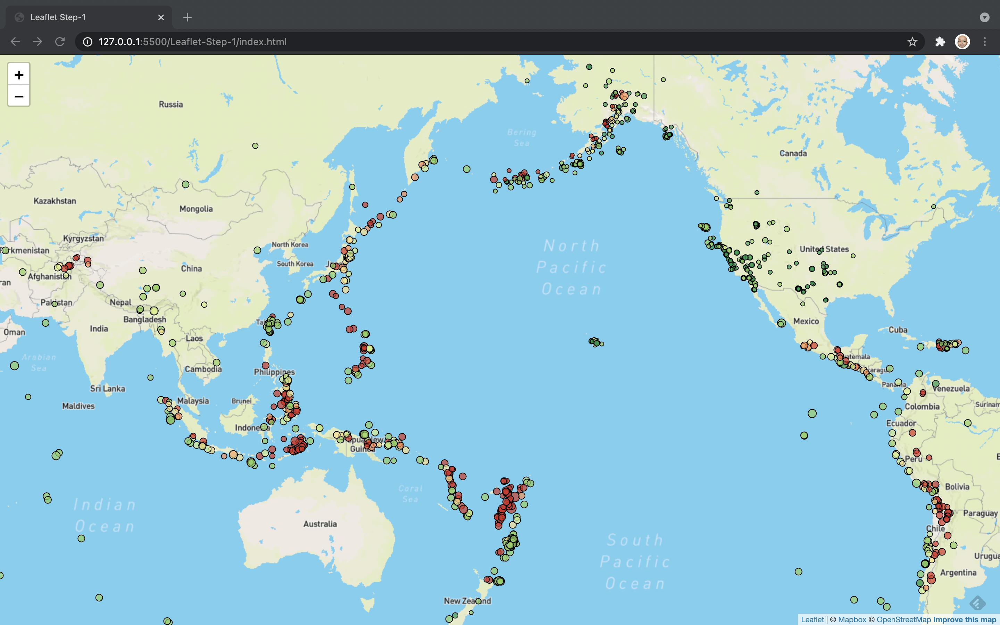

# Leaflet.js Challenge

update readme to test step1 branch

update to test new pull request

## Step 1

### Earthquake Markers
Each earthquake location is marked with a circle.  The color of the circle reflects the depth of the earthquake below the surface of the earth (in kilometers); greener circles are more shallow, redder circles are deeper.  The size of the circle reflects the magnitude of the earthquake; the larger the circle, the larger the magnitude of the earthquake.  The size/radius of each circle has been scaled so that circles that appear closer to the north or south poles are not stretched by the Mercator Projection base map.  This scaling is achieved by multiplying the raidus of each circle by the cosine of the latitude of the earthquake location.  Markers located farther north or south will have a cosine(latitude) that approaches 0, which will counter the scaling imposed by the Mercator Projection.

```radius: EQData[i].properties.mag * Math.cos((Math.PI/180)* EQData[i].geometry.coordinates[1]) * 20000```

Without cosine scaling, markers become larger as you get closer to the north and south poles:


With cosine scaling, markers maintain size with comparable magnitudes, regardless of latitude:
