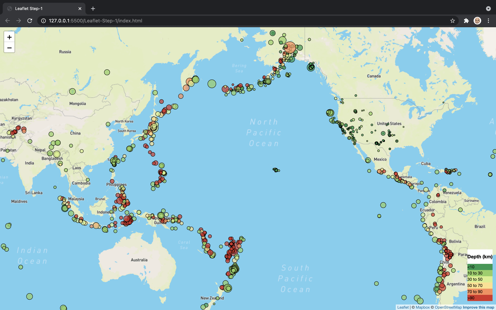
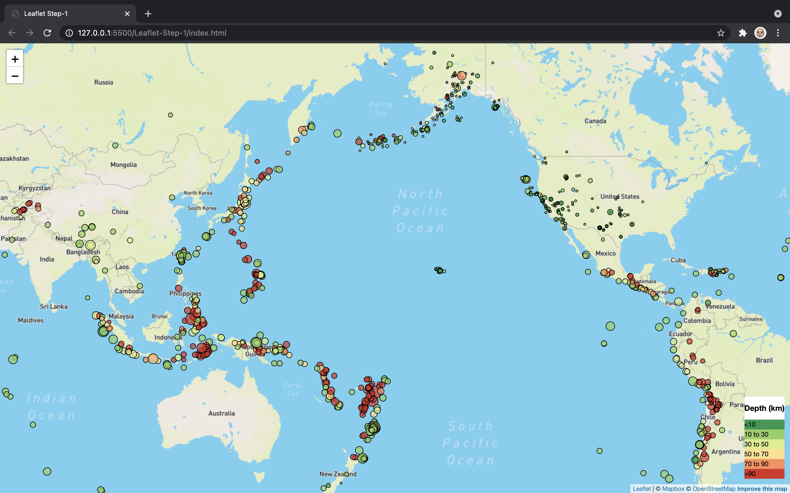

# Leaflet.js Challenge

This repository contains two versions of an earthqake map.  The earthquake data are retrieved from [USGS](https://earthquake.usgs.gov/earthquakes/feed/v1.0/summary/2.5_month.geojson)

Step 1 is a simple map of earthquakes with magnitude 2.5 or higher in the last month.  The circles representing the earthquakes are scaled based on the magnitude of the earthquake and colored based on the depth of the earthquake.

Step 2 adds multiple basemaps and outlines of the tectonic plates.

## Step 1

### Earthquake Markers
Each earthquake location is marked with a circle.  The color of the circle reflects the depth of the earthquake below the surface of the earth (in kilometers); greener circles are more shallow, redder circles are deeper.  The size of the circle reflects the magnitude of the earthquake; the larger the circle, the larger the magnitude of the earthquake.  The size/radius of each circle has been scaled so that circles that appear closer to the north or south poles are not stretched by the Mercator Projection base map.  This scaling is achieved by multiplying the raidus of each circle by the cosine of the latitude of the earthquake location.  Markers located farther north or south will have a cosine(latitude) that approaches 0, which will counter the scaling imposed by the Mercator Projection.

```radius: ((EQData[i].properties.mag)**2) * Math.cos((Math.PI/180)* EQData[i].geometry.coordinates[1]) * 5000```

Without cosine scaling, markers become larger as you get closer to the north and south poles:


With cosine scaling, markers maintain size with comparable magnitudes, regardless of latitude:


## Step 2

Step 2 of the map adds tectonic plates and multiple options for basemaps (street map, dark map, and satellite map).  Use the control in the upper right corner of the map to toggle which map you'd like as a basemap and which overlays (earthquakes and tectonic plates) to display over the basemap.


### Tectonic Plates
Tectonic plate GeoJSON data from this [GitHub repository](https://github.com/fraxen/tectonicplates)